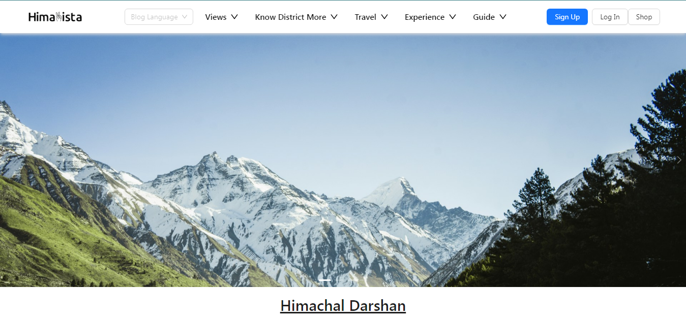
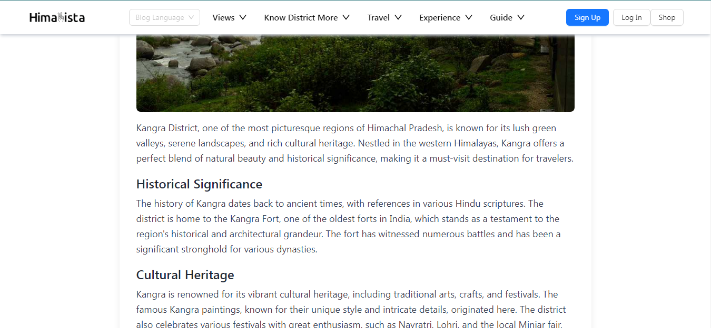
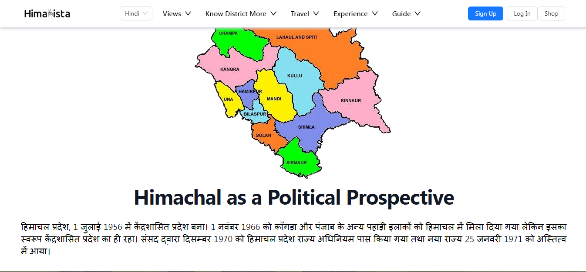

# HimaVista

## Overview

Welcome to **HimaVista**, your gateway to exploring the cultural richness and natural beauty of Himachal Pradesh. This web application is designed to immerse users in the diverse districts, cultural events, local products, and historical sites that define this beautiful region of India.

## Features

- **Explore Himachal Pradesh:** Discover various districts, cultural events, festivals, local cuisine, handicrafts, and historical sites.
- **Shop Himachal Made Products:** Integrated shopping feature to purchase authentic Himachali products.
- **User-Generated Content:** Allow local citizens and travelers to contribute blogs, videos, and images to enrich the platform.
- **Multilingual Support:** Seamlessly switch between English and Hindi languages to cater to a diverse audience.
- **Responsive Design:** Ensures a smooth user experience across desktop and mobile devices.

## Screenshots





## Technologies Used

- **Frontend:** React.js, Tailwind CSS
- **Backend:** Node.js, Express.js
- **Database:** MongoDB
- **Authentication:** JSON Web Tokens (JWT)
- **APIs:** Google Maps API, Google Cloud Translation API

## Installation

To run this project locally, follow these steps:

1. Clone the repository:
   ```bash
   git clone https://github.com/DuvenderSandhu/HimaVista-frontend.git
   cd your-repository

1. Install NPM packages
   ```sh
   npm install

1. Start the development server
   ```sh 
   npm run dev

### Contributing

Contributions are what make the open-source community such an amazing place to learn, inspire, and create. Any contributions you make are greatly appreciated.
```sh
1. Fork the Project
2. Create your Feature Branch (git checkout -b feature/AmazingFeature)
3. Commit your Changes (git commit -m 'Add some AmazingFeature')
4. Push to the Branch (git push origin feature/AmazingFeature)
5. Open a Pull Request
```
### Contact

Duvender Sandhu - anusandhu666@gmail.com


